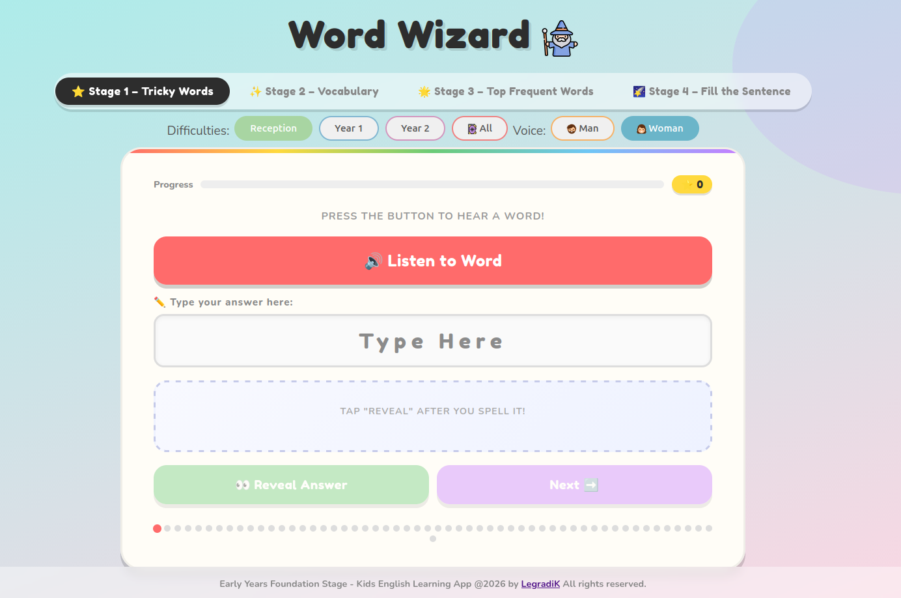

# 🧠 Word Wizard – Phonics Quiz App

A fun, interactive phonics and spelling quiz for primary school children (Reception – Year 2). Built with Flask and vanilla JavaScript.

Text-to-speech is powered by Puter AI, delivering natural-sounding British English voices (Amy & Brian). If Puter is unavailable, the app falls back to the browser's built-in speech synthesis — which works but is noticeably lower quality.

Children listen to a spoken word or sentence, type their answer, and get instant visual feedback — with letter-by-letter colour coding showing exactly what they got right or wrong. The app covers 4 stages of increasing difficulty, from simple CVC words up to full sentence comprehension, and tracks progress through each word set with a progress bar and dot indicators.

---

## 📸 Screenshots

> _Replace the placeholders below with your own screenshots._

| Stage 1 – Hear & Spell | Stage 4 – Sentence Fill |
|---|---|
|  |  |

| Stage 1 – Correct Answer | Stage 1 – Wrong Answer |
|---|---|
|  |  |


---

## 🎮 How It Works

The app has 4 stages, each targeting a different phonics skill:

**Stage 1 & 2 – Hear & Spell**
- A word is read aloud
- The child types what they hear
- On reveal, their answer is compared letter-by-letter with colour coding

**Stage 3 – Sight Words**
- Same format as Stage 1/2 but uses high-frequency word lists (Top 100 / 200 / 300)

**Stage 4 – Sentence Fill**
- A full sentence is read aloud
- The child sees the sentence with a missing word (`___`)
- They type the missing word and check their answer

---

## 🏫 Difficulty Levels

| Stage 1–2–4 | Stage 3 |
|-------------|---------|
| Reception | Top 100 |
| Year 1 | Top 200 |
| Year 2 | Top 300 |
| All |

---

## 🗂 Project Structure

```
/
├── main.py # Main .py file for running the app
├── templates/
│   ├── main.html          # Main HTML template
│   ├── base.html
│   ├── header.html
│   ├── footer.html
│   ├── stage_1.html
│   ├── stage_2.html
│   ├── stage_3.html
│   └── stage_4.html
├── static/
│   ├── screenshots
│   │      ├── stage1.png
│   │      ├── stage4.png
│   │      ├── stage1_correct_answer.png
│   │      └── stage1_wrong_answer.png
│   ├── man.png
│   ├── spellbook.png
│   ├── wizard.png
│   ├── woman.png
│   ├── script.js             # All game logic
│   └── style.css           # Styles
├── resources/
│   ├── tricky_words.py   # Word lists for stage 1
│   ├── vocabulary.py # Word lists for stage 2
│   ├── top_frequent_word_100_200_300.py # Word lists for stage 3
│   └── fill_the_sentence.py        # Sentence data for stage 4
├── .gitignore
├── requirements.txt
└── README.md

```

---

## 🚀 Getting Started

### 1. Clone the repo

```bash
git clone https://github.com/LegradiK/english_learning_app_for_kids.git
cd english_learning_app_for_kids
```

### 2. Install dependencies

```bash
pip install -r requirements.txt 
```

### 3. Run the app

```bash
python main.py
```

Then open [http://localhost:5000](http://localhost:5000) in your browser.

---

## 🔊 Text-to-Speech

The app uses two TTS methods, in order of preference:

1. **Puter AI** (`puter.ai.txt2speech`) – neural British English voices (Amy / Brian)
2. **Browser SpeechSynthesis** – fallback if Puter is unavailable

Voice can be switched between female (Amy) and male (Brian) using the voice toggle in the UI.

---

## 📝 Adding Your Own Words / Sentences

**Spelling words** (`data/<choose_file>.py`):
```python
reception = ["cat", "dog", "sun", ...]
year1     = ["jumped", "flag", "cake", ...]
year2     = ["jumping", "careful", "rainbow", ...]
```

**Sentences** (`data/sentences.py`):
```python
reception = [
    {
        "quiz_sentence":   "The ___ sat on the mat.",
        "answer_sentence": "The cat sat on the mat.",
        "answer":          "cat"
    },
    ...
]
```

---

## 🛠 Built With

- [Flask](https://flask.palletsprojects.com/) – Python web framework
- Vanilla JavaScript – no frameworks
- Web Speech API / Puter AI – text-to-speech
- CSS Grid & Flexbox – layout and letter tiles

---

## 🎨 Icon Credits

Icons used in this project are sourced from [Flaticon](https://www.flaticon.com):

- [Witch icons](https://www.flaticon.com/free-icons/witch) created by Freepik - Flaticon
- [Wizard icons](https://www.flaticon.com/free-icons/wizard) created by Freepik - Flaticon
- [Beard icons](https://www.flaticon.com/free-icons/beard) created by Sudowoodo - Flaticon
- [Girl icons](https://www.flaticon.com/free-icons/girl) created by Sudowoodo - Flaticon

---

## 📄 Licence

MIT — free to use and modify for educational purposes.